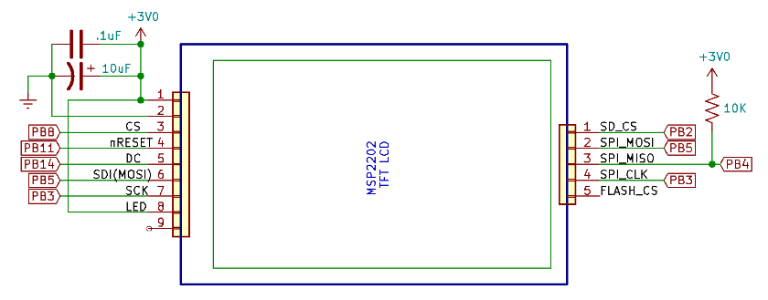
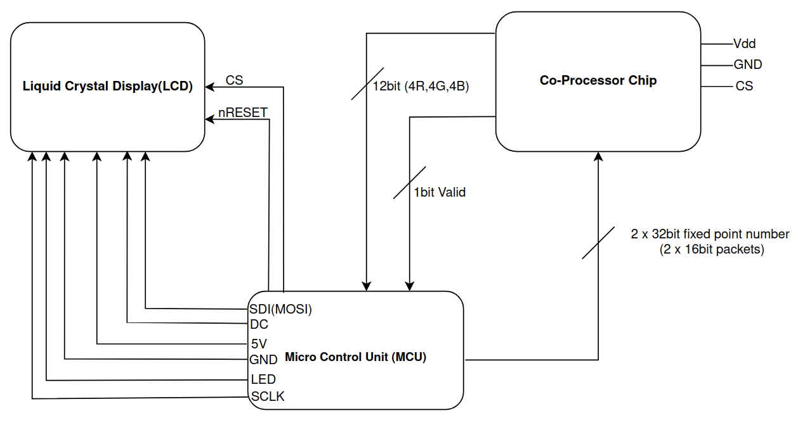

# STARS 2023 Design Final Project

## [DigiDoggs]
* [Connor Powell]
* [Farren Martinus]
* [Isaac Bourff]
* [Xavier Williams]
* [Spencer Bowles]

## [Spi Mandlebrot Renderer]
**Functionality:**

The chip we developed performs calculations for generating the Mandelbrot fractal using imaginary number generation. It contains a specialized algorithm to efficiently compute the complex mathematical calculations involved in rendering the fractal. If you would like more context as to what is going on behind the scenes here is a link to check out: [Mandlebrot Fractal](https://mathigon.org/course/fractals/mandelbrot)

The microcontroller acts as a control unit, managing the communication between the integrated mathematical rendering chip and the lcd display.

The SPI interface enables data transfer between the microcontroller and the integrated chip as well as the lcd screen for reading and writing pixel data. It allows the microcontroller to send configuration parameters and receive calculated data from the chip.

**Instructions for Use:**

Wire the chip according to the provided wiring diagrams. Ensure that the chip's SPI pins (such as SCLK, MOSI, and CS) are correctly connected to the corresponding pins on the microcontroller and the lcd otheriwse the LCD will only display a white screen.

To set up the microcontroller and teh required software follow this guide up to 6.2 [MCU Setup](https://ece362-purdue.github.io/f2022-public-labs/lab-5.0/lab_5.html)

Copy paste the suppoting files into the <.inc> folder and the <.main> and then build the program by using the debug feature covered in the feature above (big green button)

After wiring everything properly and downloading supporting softwares you can press the reset button on the MCU to render the fractal again (it should render right after the last step)

## Pin Layout
//MORE TO BE ADDED HERE WHEN WE KNOW//  
LCD Wiring to the MCU Diagram

## Supporting Equipment
STM32F091RCT microcontroller development board  
MB-108 R.S.R Electronics Breadboard  
Windows/OSX/Linux Laptop with System Workbench installed/setup  
QVGA 2.2 inch TFT SPI 240x320 LCD   

## RTL Diagrams
Top Level RTL:

## Some Legal Statement
From Purdue that I haven't figured out yet, maybe some stuff about Dr. J, the program, and other instructors